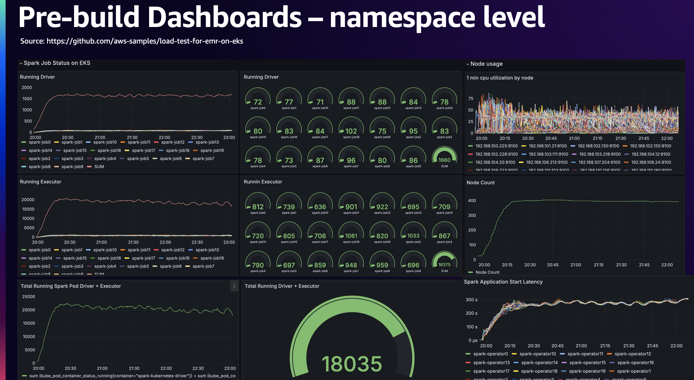
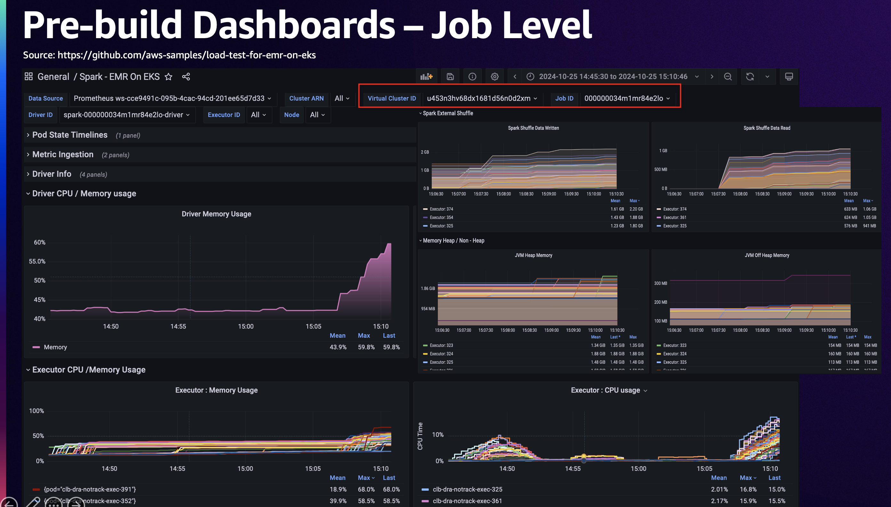
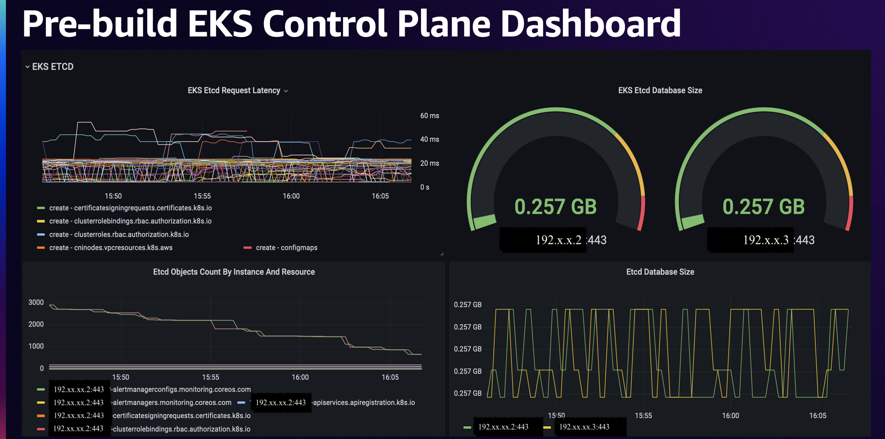
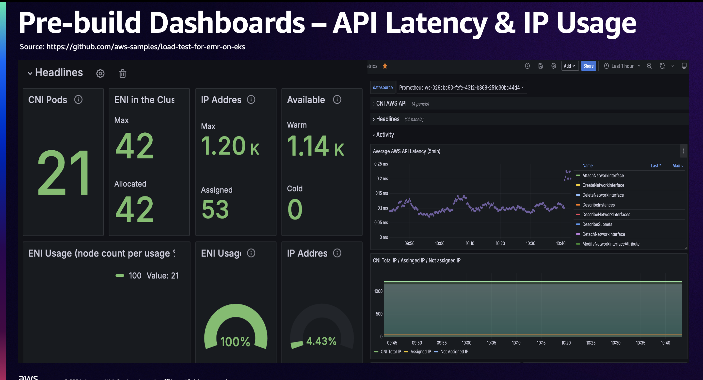

## EMR on EKS Load Test Benchmark Utility

This repository provides a general tool to benchmark EMR scalability performance on EKS cluster, supporting all three job submission types: Spark Operator, JobRun API, and Spark Submit. This out-of-the-box solution includes complete infrastructure setup for EKS clusters and a load testing job generator powered by the Locust Kubernetes Operator. It also features pre-built Grafana dashboard templates which can be used directly to observe your test result and throttling events. With zero to minimal setup overhead, you can quickly establish a large-scale load testing environment via this utility.

# Table of Contents
- [Prerequisite](#prerequisite)
- [Set up Test Environment](#set-up-test-environment)
  - [Prerequisite](#prerequisite---set-environment-variables)
  - [Create the EKS Cluster with Necessary Components(Optional)](#create-an-eks-cluster-with-components-needed-optional)
  - [Install Locust Operator on EKS](#install-locust-operator-on-eks)
- [Get Started](#get-started)
  - [Prerequisite](#prerequisite---update-job-script)
  - [Run test from local](#1-run-load-test-locally)
  - [Run test on EKS](#2-load-test-on-eks)
- [Best Practice Guide](#best-practices-and-considerations)
  - [How to Allocate Pods](#1-how-to-allocate-spark-driver--executor-pods)
  - [DONOT Use Sidecars Whenever Possible](#2-try-not-to-use-initcontainersor-custom-sidecar)
  - [Binpacking pods](#3-binpacking-application-pods)
  - [Cluster Scalability](#4-cluster-scalability)
  - [Networking in EKS](#5-best-practices-for-networking)
- [Monitoring](#monitoring)
- [Clean up](#clean-up)

## Prerequisite
- eksctl is installed in latest version ( >= 0.194.)
```bash
curl --silent --location "https://github.com/weaveworks/eksctl/releases/latest/download/eksctl_$(uname -s)_amd64.tar.gz" | tar xz -C /tmp
sudo mv -v /tmp/eksctl /usr/local/bin
eksctl version
```
- Update AWS CLI to the latest (requires aws cli version >= 2.17.45) on macOS. Check out the [link](https://docs.aws.amazon.com/cli/latest/userguide/getting-started-install.html) for Linux or Windows
```bash
curl "https://awscli.amazonaws.com/AWSCLIV2.pkg" -o "AWSCLIV2.pkg"
sudo installer -pkg ./AWSCLIV2.pkg -target /
aws --version
rm AWSCLIV2.pkg
```
- Install kubectl on macOS, check out the [link](https://kubernetes.io/docs/tasks/tools/install-kubectl-linux/) for Linux or Windows.( >= 1.31.2 )
```bash
curl -LO "https://dl.k8s.io/release/$(curl -L -s https://dl.k8s.io/release/stable.txt)/bin/linux/amd64/kubectl"
sudo install -o root -g root -m 0755 kubectl /usr/local/bin/kubectl
kubectl version --short --client
```
- Helm CLI ( >= 3.13.2 )
```bash
curl -sSL https://raw.githubusercontent.com/helm/helm/master/scripts/get-helm-3 | bash
helm version --short
```

[^ back to top](#table-of-contents)

## Set up Test Environment

### Prerequisite - Set Environment Variables
Please update the values in `./env.sh` based on your environment settings.
Alternatively, use the default configurations shown as below:

<details>
<summary>Default Environment Variables</summary>

```bash
# General
export AWS_REGION=us-west-2
export ACCOUNT_ID=$(aws sts get-caller-identity --query Account --output text)
export LOAD_TEST_PREFIX=load-test-cluster
export CLUSTER_NAME=${LOAD_TEST_PREFIX}-10
export BUCKET_NAME=emr-on-${CLUSTER_NAME}-$ACCOUNT_ID-${AWS_REGION}
# Locust
export EMR_IMAGE_VERSION=7.9.0
export SPARK_JOB_NS_NUM=2 # number of namespaces/VC to create
export LOCUST_EKS_ROLE="${CLUSTER_NAME}-locust-eks-role"
export JOB_SCRIPT_NAME="emr-job-run.sh"

# ================================================
# Required variables for infra-provision.sh. 
# If skip the infra setup step, remove this unnecessary section
# ================================================
# EKS
export EKS_VPC_CIDR=192.164.0.0/16
export EKS_VERSION=1.34
# EMR on EKS
export PUB_ECR_REGISTRY_ACCOUNT=895885662937
export EXECUTION_ROLE=emr-on-${CLUSTER_NAME}-execution-role
export EXECUTION_ROLE_POLICY=${CLUSTER_NAME}-SparkJobS3AccessPolicy
# Karpenter
export KARPENTER_VERSION="1.8.1"
export KARPENTER_CONTROLLER_ROLE="KarpenterControllerRole-${CLUSTER_NAME}"
export KARPENTER_CONTROLLER_POLICY="KarpenterControllerPolicy-${CLUSTER_NAME}"
export KARPENTER_NODE_ROLE="KarpenterNodeRole-${CLUSTER_NAME}"
# Create Amazon Managed Grafana workspace or not
export USE_AMG="true"
# =======================================================================
```
</details>

### Create an EKS Cluster with components needed (OPTIONAL)
A `infra-provision.sh` script is provided by the project, which creates a brand new EKS cluster with the following components. 

Skip this step if you use an existing EKS cluster. If required, install missing components individually, such as EBS CSI Driver, based on the infra provision script. 

- [Auto Scaler](https://aws.github.io/aws-emr-containers-best-practices/troubleshooting/docs/eks-cluster-auto-scaler/)
- [Load Balancer Controler](https://docs.aws.amazon.com/eks/latest/userguide/lbc-helm.html)
- [EBS CSI Driver Addon](https://docs.aws.amazon.com/eks/latest/userguide/ebs-csi.html)
- [Karpenter](https://aws.github.io/aws-emr-containers-best-practices/troubleshooting/docs/karpenter/)
- [BinPacking](https://awslabs.github.io/data-on-eks/docs/resources/binpacking-custom-scheduler-eks) 

Monitoring by default uses managed services:
- [Amazon Managed Prometheus](https://aws.amazon.com/prometheus/)
- [Amazon Managed Grafana](https://aws.amazon.com/grafana/)

#### 1. Modify EKS cluster and components' configurations before provisioning the environemnt
- For eks cluster, update [./resources/eks-cluster-values.yaml](./resources/eks-cluster-values.yaml)
- For autoscaler, modify [./resources/autoscaler-values.yaml](./resources/autoscaler-values.yaml)
- For custom k8s scheduler, update [./resources/binpacking-values.yaml](./resources/binpacking-values.yaml)
- For Karpenter, update yaml files under the [./resources/karpenter/](./resources/karpenter/)
- For Prometheus, update [./resources/monitor/prometheus-values.yaml](./resources/monitor/prometheus-values.yamlprometheus-values.yaml)
- For Prometheus's podmonitor and servicemonitor settings, update files under the [./resources/monitor](./resources/monitor)

#### 2. Run the script after all the customizations are done.
NOTE: at the end of script, 2 ECR container images will be built and pushed : Spark benchmark and Locust.
```bash
bash ./infra-provision.sh
```

### Install Locust Operator on EKS
[Locust](https://docs.locust.io/en/stable/locust-cloud/locust-cloud.html#kubernetes-operator) is an open source load testing tool based on Python. 

This project offers a provison scirpt `locust-provision.sh` to setup a Locust k8s Operator via a helm chart. Before run the scirpt, modify the [operator's RBAC permission](./locust/locust-operator/patch-role-binding.yaml) and [IRSA role policy](./locust/locust-operator/eks-role-policy.json) based on your requirement.
```bash
# create IRSA role and install locust operator
bash ./locust-provision.sh
```
[^ back to top](#table-of-contents)

## Get Started

 To get an optimal load test outcome, you can configure your compute resource allocation via Spark settings. See the best practice section: [How to Allocate Pods](#1-how-to-allocate-spark-driver--executor-pods).

### Prerequisite - Update job script
This project supports most of EMR on EKS load test cases with a defualt monitoring configuration, ie. AWS Managed Promethues + Managed Grafana. Before getting started, replace the sample job run file [./locust/locustfiles/emr-job-run.sh](./locust/locustfiles/emr-job-run.sh) by your actual EMR on EKS job submission script. Don't change the directory location, becuase it will be mapped into each Locust containers's home directory `/home/locust` via a configmap called `emr-loadtest-locustfile`. More detials can be found in the [locust-provision.sh](https://github.com/aws-samples/load-test-for-emr-on-eks/blob/b389458ff4ebb1b829f6fd9c8aa49405c482bfc9/locust-provision.sh#L124) script. The setup looks like this:
```bash
kubectl create configmap emr-loadtest-locustfile --namespace locust --from-file=locust/locustfiles
```

NOTE: delete then recreate this configmap if your the submission script or other python script are changed. Otherwise, Locust operator will only read from its previous version before any changes. Don't need to refresh the configma if running a test locally via `locust -f ./locustfiles/locustfile.py ....`
```bash
kubectl delete configmap emr-loadtest-locustfile --namespace locust
```
[^ back to top](#table-of-contents)

### 1. Run Load Test Locally
Let's run a small test from a local terminal window. The following parameters are available to adjust before run the Locust CLI:
```bash
# -u or --users, How many users are going to submit the jobs concurrently.
#     Used a default wait interval (between 20s-30s per user) before submit the next job. 
# -t or --run-time, The total load test period.
# --emr-script-path, Set by env.sh. Load test job's shell script name. 
# --job-azs, Default: None. a list of AZs available in the EKS's VPC. It means pods in a single job will be scheduled to multiple AZs which could cause data transfer fee and performance downgrade. If it's set (see below), all pods of a job will be scheduled to a single AZ. NOTE: The AZ selection is random not round robin.
# --job-ns-count, Default: 2 namespaces. Total number of namespaces/VCs that jobs will be submitting to.

cd load-test-for-emr-on-eks
python -m venv .venv
source .venv/bin/activate
sudo pip install -r locust/requirements.txt
source env.sh

locust -f locust/locustfiles/locustfile.py --run-time=2m --users=2 --spawn-rate=.5 \
--job-azs '["us-west-2a","us-west-2b"]' \
--job-ns-count 2 \
--skip-log-setup \
--headless
```
When the load test session is finished or in progress, you can cancel these jobs and delete EMR-on-EKS virtual clusters:
**WARNING:** `Locust creates new namespace(s)/VC(s) at each test run. Any previously created VCs must be terminated before starting a new test session. Otherwise, the aggregated job stats will be affected by data from old test sessions, causing fluctuations in the results. Before delete any load test namespaces in EKS, use the "stop_test.py" script to ensure all EMR-EKS jobs and VCs are terminated.`
```bash
# --id, terminate VCs by a test session id. The unique id is used as namespace prefix "emr-{uniqueID}-{date}"
# --cluster, cancel test jobs across all VCs on the eks cluster.A default value is set.
python3 locust/locustfiles/stop_test.py --cluster $CLUSTER_NAME  
# or 
python3 locust/locustfiles/stop_test.py
# delete namespaces if needed
kubectl get namespaces -o name | grep "emr" | xargs kubectl delete
```

[^ back to top](#table-of-contents)

### 2. Load Test on EKS
Locust Operator supports a distributed way of load test. By default, it fires up load testing from a cluster of 1 master+ 2workers pods. Each of which initlizes a test session with a unique session ID.

Update the locust test CRD manifest file by actual environment attributes, then start the load test from an EKS cluster:
```bash
cd load-test-for-emr-on-eks
kubectl apply -f examples/load-test-pvc-reuse.yaml

# check summarized load test metrics at master node
kubectl logs -f -n locust -l locust.cloud/component=master
# check load test status at job level
kubectl logs -f -n locust -l locust.cloud/component=worker
```

<!-- ```bash
# access to Locust WebUI: http://localhost:8089/
kubectl port-forward svc/pvc-reuse-cluster-10-webui -n locust 8089
``` -->

[^ back to top](#table-of-contents)

## Best Practices and Considerations

### 1. How to Allocate Spark Driver & Executor Pods
To minimise the cross-node DataIO and networkIO penalty in a single Spark job, it is recommended trying to allocate the Spark executor pods into the same node as much as possible.

However, in oder to reduce the compute cost, we configured executor's node pool with an aggressive node consolidation rule. To avoid the eviction impact on Driver pod ( alive throughout its entire job lifecycle), we created a seperate Karpenter node pool for Driver pods in this load test.

Additionally, to avoid cross-AZ data transfer fee and downgraded job performance, the load test framework (`locust/locustfile.py`) populates AZ value of `spark.kubernetes.node.selector.topology.kubernetes.io/zone` dymaically in job submission, tighting all pods within a job to the specified single AZ. If your managed node group or Karpenter nodepool is configured as a single-AZ node provisoners, you can simply use a nodegroup/nodepool name as the nodeSelector to ensure your job's pods are in a single AZ. See the exmaple below:

```yaml
# nodeSelector sample as below:
"spark.kubernetes.node.selector.topology.kubernetes.io/zone": "us-west-2a"

# Or match by a kapenter nodepool name
"spark.kubernetes.node.selector.karpenter.sh/nodepool": "single-az-nodepool-name"

# Or match by a nodegroup name managed by cluster autoscaler
"spark.kubernetes.driver.node.selector.eks.amazonaws.com/nodegroup": "m5-ng-uw2a",
```
[^ back to top](#table-of-contents)

### 2. Try Not to Use `initContainers`or Custom Sidecar.
The number of k8s events in EKS emitted by Spark jobs increases significantly, as soon as we enable the `initContainers`. As a result, EKS API Server and ETCD DB size will be filled up quicker than normal. It is recommended to avoid the `initContainers` or sidecar containers in a large scale workload on an EKS cluster. Otherwise, please consider to split your workload to multiple EKS clusters or pay extra to use [Provisioned Control Plane](https://docs.aws.amazon.com/eks/latest/userguide/eks-provisioned-control-plane.html) offered by EKS.

### 3. Binpacking Application Pods

There are two types of binpackings:
- Custom k8s scheduler - binpack pods at job launch time
- Karpenter's consolidation feature - binpack pods or replace underutilized nodes at job run time

**Binpack at Launch Time** - a custom k8s scheduler can efficiently assign pods to the least allocated nodes before a new node is requested. The goal is to optimize resource utilization by packing pods as tightly as possible onto a single node, while still meeting resource requirements and constraints. 

This approach aims to maximize cluster efficiency, reduce costs, and improve overall Spark job's shuffle IO performance by minimizing the number of active nodes required to run the workload. Becuase with Binpacking enabled, workloads can minimise the resources used on network traffic between physical nodes, as most of pods will be allocated in a single node at its launch time. The Spark configuration at job submission looks like this:
```bash
  "spark.kubernetes.scheduler.name": "custom-scheduler-eks"
```

**Binpack at Run Time** - the launch-time binpacking doesn't solve the resources wastage or cost spike caused by frequent pod terminations, such as by Spark's Dynamic Resource Allocation (DRA). That's why another binpack feature needs to co-exist in our use case, ie. enable Karpenter's consolidation feature for ( only for) executor's nodepool, in order to maximize pods density at job's run time.

Learn more about Binpacking via link: https://aws.github.io/aws-emr-containers-best-practices/performance/docs/binpack/

[^ back to top](#table-of-contents)


### 4. Cluster Scalability

EKS Cluster autoscaling contains two main types:
  - [EKS Cluster Autoscaler (CAS)](https://docs.aws.amazon.com/eks/latest/best-practices/cas.html)
  - [Karpenter (default)](https://docs.aws.amazon.com/eks/latest/best-practices/karpenter.html)

**EKS Cluster Autoscaler (CAS)** - This project's EKS cluster is configured with three managed node groups: 
- 1/ Operational CAS for operational services ( fixed size: 2 nodes). It is used to host Prometheus, Load Balancer, Karpenter etc. operational pods
- 2/ Two Application managed nodegroups ( one per AZ) to scale between 1 and 350 m5.xlarge EC2 nodes for load test jobs.

To schedule a large volume of nodes, the qps and burst rate in the [CAS configuration](./resources/autoscaler-values.yaml) needs to increase, to avoid its throttling:
```yaml
podAnnotations:
  cluster-autoscaler.kubernetes.io/safe-to-evict: 'false'
...
extraArgs:
...
  kube-client-qps: 300
  kube-client-burst: 400
```

**Karpenter** - In this project, we only provision load test jobs by Karpenter, the rest of operational pods, eg: Prometheus, Karpenter, Binpacking etc. are scheduled in a fix-sized opertional NodeGroup, which is out of controll by Karpenter.

- Karpenter Nodepool configs
    - To apply the best practice in cost and performance, we utilize the `topology.kubernetes.io/zone` node selector to ensure Spark's pods in a single job are all allallocated into the same AZ.

```bash
  "spark.kubernetes.executor.node.selector.karpenter.sh/nodepool": "executor-nodepool",
  "spark.kubernetes.driver.node.selector.karpenter.sh/nodepool": "driver-nodepool",
  "spark.kubernetes.node.selector.topology.kubernetes.io/zone": "ua-west-2a",
```

[^ back to top](#table-of-contents)

### 5. Best Practices for Networking
With large volume of workloads, IP addresses often exhaustes. To solve this, we have some tips to address the network problem:
- Use `AWS VPC CNI` - to set up a 2nd or more CIDRs for your EKS cluster, instead of utilizing the primary subnet. Please learn more about this technique here: https://aws.github.io/aws-eks-best-practices/networking/custom-networking/
- To minimise IP wastage per existing subnet, you should try to fine tune the following VPC CNI configs: 
    - `WARM_ENI_TARGET`
    - `WARM_PREFIX_TARGET` 
    - `WARM_IP_TARGET`, `MINIMUM_IP_TARGET`
More details can be found in the [EKS networking best practice](https://docs.aws.amazon.com/eks/latest/best-practices/networking.html), [VPC-CNI concepts](https://aws.github.io/aws-eks-best-practices/networking/vpc-cni/) and the [Prefix Delegation](https://docs.aws.amazon.com/eks/latest/best-practices/prefix-mode-linux.html).

In our tests, the following configurations presents the fastest EC2 start-up speed, but with the trade-off pod-indensity flexibility:

- `MINIMUM_IP_TARGET`=29 (Max EBS volume/node is usually 27)
- `WARM_IP_TARGET`=3
- `ENABLE_IP_COOLDOWN_COUNTING`=false
- `WARM_ENI_TARGET`=0
- `WARM_PREFIX_TARGET`=1 (value can't be 0, but can be override by WARM_IP_TARGET>0)

[^ back to top](#table-of-contents)

## Monitoring:

We have built insightful monitoring dashboards for the load test, with [Amazon Managed Prometheus](https://aws.amazon.com/prometheus/) and [Amazon Managed Grafana](https://aws.amazon.com/grafana/) setup in infra-provision.sh by default.

<table align="center">
  <tr>
    <td>
      
      <p align="center">Spark Operator Dashboard</p>
    </td>
    <td>
      
      <p align="center">EMR on EKS Dashboard</p>
    </td>
  </tr>
  <tr>
    <td>
      
      <p align="center">EKS Control Plane</p>
    </td>
    <td>
      
      <p align="center">AWS CNI Metrics</p>
    </td>
  </tr>
</table>

### 1. Observe Load Testing with Amazon Managed Prometheus and Amazon Managed Grafana

#### 1.1 Set up AMP & AMG
Please aware, `./infra-provision.sh` has included Amazon Managed Prometheus setup by default. Please just follow the below guidence to set up Amazon Managed Grafana:
<details>
<summary>Here are the steps to install Amazon Managed Grafana </summary>

- In `./env.sh`, keep the default value as below, which creates AMG workspace automatically:
```bash
export USE_AMG="true"
```
If you do not have the IAM Identity Center(IDC) enabled in your test region and AWS account, follow the instruction [here](https://docs.aws.amazon.com/databrew/latest/dg/sso-setup.html) to create one.

- Set up the access for Amazon Grafana:
    - Access to AWS console -> search "Amazon Grafana" -> click the three lines icon at top left of the page -> choose "All workspaces";
    - click on the workspace name, which is the same value of the `CLUSTER_NAME` value;
    - From Authentication tab -> click "Assign new user or group";
    - Select your account -> click "Assign Users and groups";
    - Select your account again -> click "Action" -> "Make admin";
    - Finally, find the "Grafana workspace URL" from the workspace detail page -> click on the URL.

- Sign in the Grafana UI via IAM Identity Center access;
- Set up Amazon Managed Prometheus Datasource via:
    - Navigate to Apps -> Amazon Data Sources -> `Amazon Managed Service for Prometheus`;
    - Select `region` align with your load test region, eg: `us-west-2`;
    - Select the Region then Click Add data source.
    - `Go to Settings`, scroll down to the bottom and click `Save & test` to verify the connection.

- Import Pre-buid Grafana Dashboard Templates:
    - Navigate to `Dashboards` side menu, hit "New" button -> choose `Import` from the drop down list;
    - You can either use "file upload" or "Copy & Paste" approaches to import the raw content of `./grafana/dashboard-template/spark-operator-dashbord.json`, click `Load`;
    - Select your data source, which align with the AMP connection setup previously, eg: `Prometheus ws-xxxx.....`
    - Repeat above steps to import the rest of templates under the directory: `./grafana/dashboard-template/`;


Please be aware of that the below charts are not working, which is expected due to the `kubelet` will generate the large volume of metrics and it will boost prometheus memory usage.
- Prometheus Kubelet Metrics Series Count
- Spark Operator Pod CPU Core Usage

If you want to enable them, then please update `./resources/monitor/prometheus-values.yaml` as below:
```yaml
kubelet:
  enabled: true
```

</details>

[^ back to top](#table-of-contents)


### 2. Metrics & Evaluation

Please refer to the [Grafana README](./grafana/README.md) document for detailed explanation, how to monitor and evaluate your performance in Locust, Spark Operator, EKS cluster, IP utilization, etc.

## Clean up
```bash
# To remove the resources that created by ./infra-provision.sh.
bash ./clean-up.sh 
```

[^ back to top](#table-of-contents)


## Security

See [CONTRIBUTING](CONTRIBUTING.md#security-issue-notifications) for more information.

## License

This library is licensed under the MIT-0 License. See the LICENSE file.

