# Spark Operator Load Test Dashboard Explain

This document explains meaning of each metrics on spark operator grafana dashboard.

Before the discussion we need to first understand how spark operator works. Following diagram gives a simple description on spark operator workflow

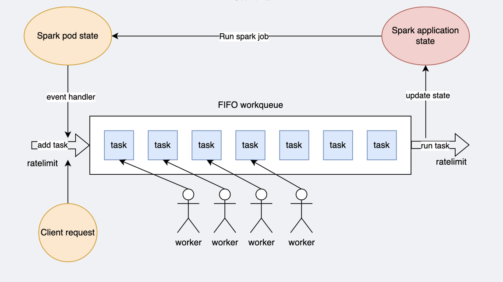

In the center of sparkapplication is a work queue. This work queue is responsible of updating sparkapplication CRD status or run corresponding actions based on the input event. Following is the example of life of spark application

1. User creates sparkapplication → sparkapplication in NEW state

2. spark operator detects New sparkapplication → spark application run spark-submit → spark operator changes sparkapplication to Submitted state 

3. Spark driver starts running → spark operator changes sparkoperator to Running state 

4. Spark driver starts running → spark operator changes executor states in sparkapplication to Running

5. Spark executors completed → spark operators changes executor states in sparkapplication to Completed

6. Spark driver completed → spark operator changes sparkapplication to Succeeding state

7. If no retry needed → spark operator changes sparkapplication to Completed state

Following is detailed state machine for spark application

[https://github.com/kubeflow/spark-operator/blob/c261df66a00635509f7d8cb2a7fba4c602c9228e/pkg/controller/sparkapplication/controller.go#L485](https://github.com/kubeflow/spark-operator/blob/c261df66a00635509f7d8cb2a7fba4c602c9228e/pkg/controller/sparkapplication/controller.go#L485)

The metrics in grafana dashboard is divided in following groups. We will not discuss the first 2 Prometheus related metric groups as they are used only for monitoring Prometheus

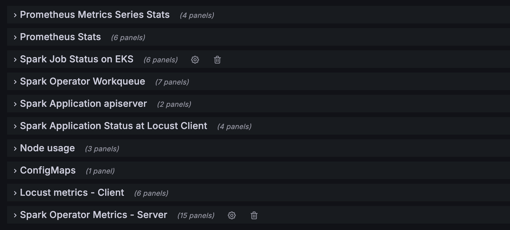

## Spark Job Status on EKS


These metrics are used to track the running spark driver pod and executor pod number.

### Running Driver

It calculate number of driver pod in running state by namespace and their sum

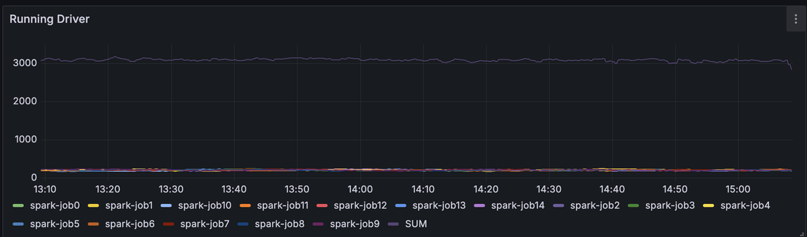
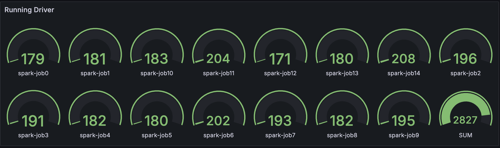

**Calculation**

`sum by (namespace)(kube_pod_container_status_running{container="spark-kubernetes-driver"})`

`sum (kube_pod_container_status_running{container="spark-kubernetes-driver"})`

### Running Executor 

It calculates number of executor pod in running state by namespace and their sum

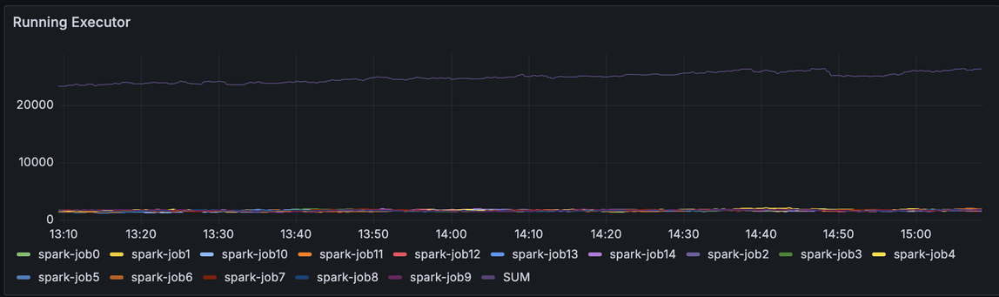
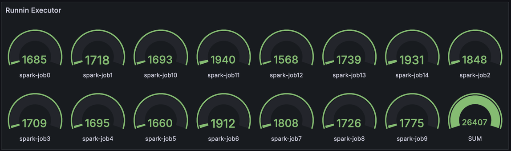

**Calculation**

`sum by (namespace)(kube_pod_container_status_running{container="spark-kubernetes-executor"})`

`sum (kube_pod_container_status_running{container="spark-kubernetes-executor"})`

### Total Running Spark Pod Driver + Executor

This the sum of total number of drivers and executors

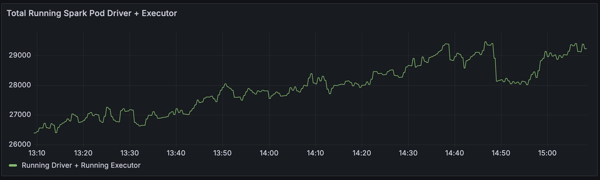
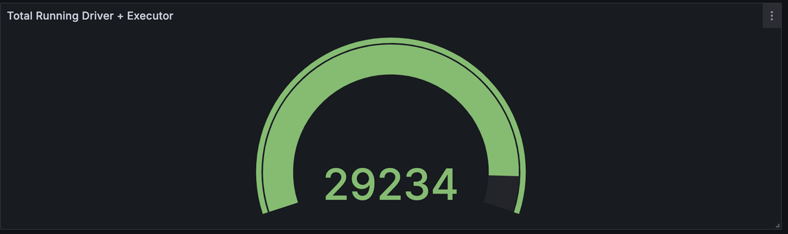

**Calculation**

`sum (kube_pod_container_status_running{container="spark-kubernetes-driver"}) + sum (kube_pod_container_status_running{container="spark-kubernetes-executor"})`


[^ back to top](#spark-job-status-on-eks)

## Spark Operator Workqueue

### spark_application_controller_adds enqueue

It counts one minute rate (per second) of number items added to workqueuec (each spark operator is in a dedicated namespace)

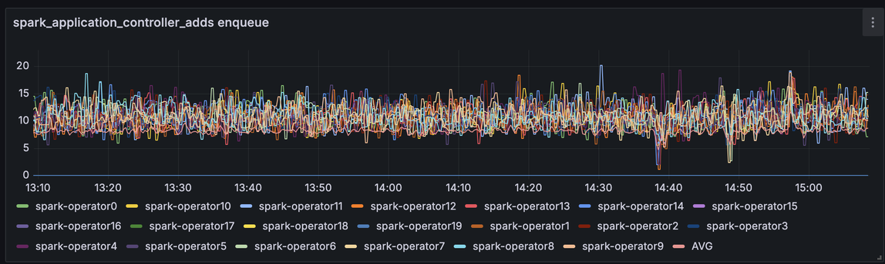
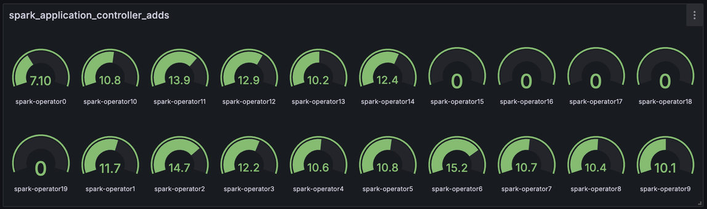

**Calculation**

```
rate(spark_application_controller_adds[1m])
avg(rate(spark_application_controller_adds[1m]))
```

### spark_application_controller_work_duration_count dequeue

It calculates one minute rate (per second) of number items removed from workqueue grouped by namespace

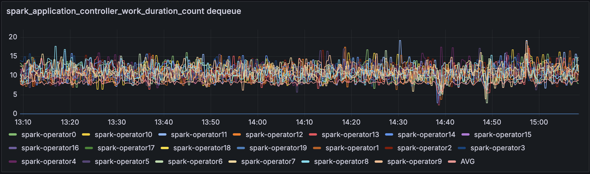
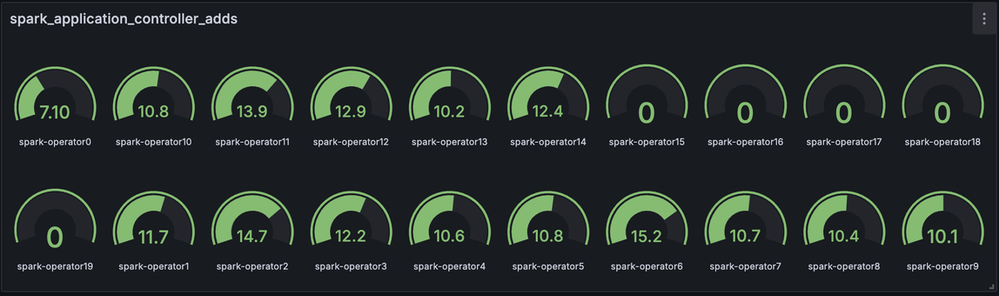

`rate(spark_application_controller_work_duration_count [1m])`

`avg(rate(spark_application_controller_work_duration_count [1m]))`

### Spark Application Controller Latency 

It calculates avery time from an item is added to the workqueue to the time when the item is fetched from workqueue by spark operator worker, which means it measures how much time an item has to stay on the queue before it is fetched

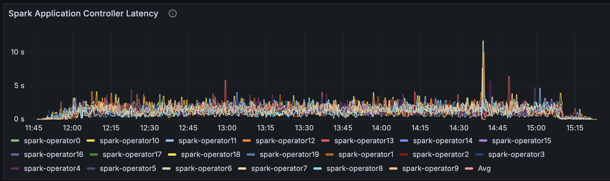

**Calculation**

```
rate(spark_application_controller_latency_sum[1m])/rate(spark_application_controller_latency_count[1m])
avg(rate(spark_application_controller_latency_sum[1m])/rate(spark_application_controller_latency_count[1m]))
```

### Spark Application Controller Task Process Time

When a worker fetch an item from the workqueue, it will spend sometime processing the item then import workqueue the process is finished. This metrics measures the average time taken from the item is feched from the queue to the time when the item finished processing.

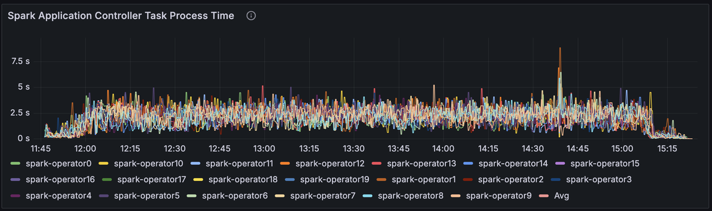

**Calculation**

`rate(spark_application_controller_work_duration_sum [1m])/rate(spark_application_controller_work_duration_count [1m])`

`avg(rate(spark_application_controller_work_duration_sum [1m])/rate(spark_application_controller_work_duration_count [1m]))`

### Spark Application Controller Queue Depth

This metrics measures spark operator workqueue depth

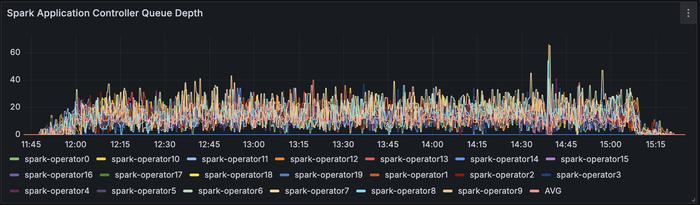

**Calculation**

`spark_application_controller_depth`

`avg(spark_application_controller_depth)`


[^ back to top](#spark-job-status-on-eks)

## Spark Application API Server

### apiserver_request_total

This metrics measures rate of API server request on resource sparkapplication. Since spark operator is responsible for updating sparkapplication CRD status, this metrics can also tell us how fast or how sensitive spark operator reacts to workqueue input.

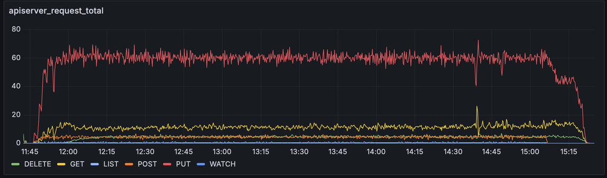
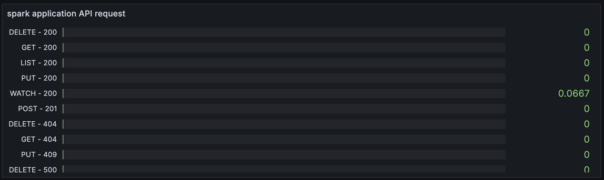

**Calculation**

`sum by(verb) (rate(apiserver_request_total{resource="sparkapplications"}[1m]))`


[^ back to top](#spark-job-status-on-eks)

## Spark Application Status at Locust Client

The load test uses a [locust](https://locust.io/) client running on an EC2 instance to create sparkapplication to EKS. From the same locust client, a separate thread runs every 30 seconds to get a list of all sparkapplication and count their status at the given point of time

```java
                for app in spark_apps['items']:
                    if 'status' in app:
                        app_state = app['status']['applicationState']['state']
                        if app_state == 'RUNNING':
                            running_app_count += 1
                        elif app_state == "SUBMITTED":
                            submitted_app_count += 1
                        elif app_state == "SUCCEEDING":
                            succeeding_app_count += 1
                        elif app_state == "COMPLETED":
                            completed_app_count += 1
                    if 'status' not in app:
                            new_app_count += 1
```

### NEW

This metrics counts number of sparkapplications that are created but not yet submitted at the given point of time

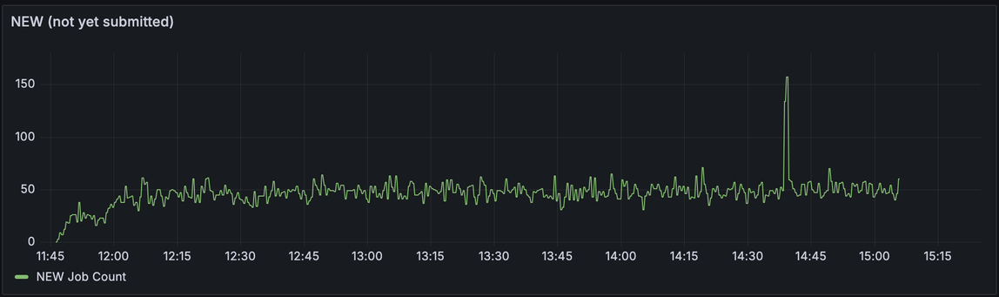

**Calculation**

`locust_new_spark_application_gauge`

### SUBMITTED

This metrics counts number of submitted sparkapplications but not running yet at the given point of time

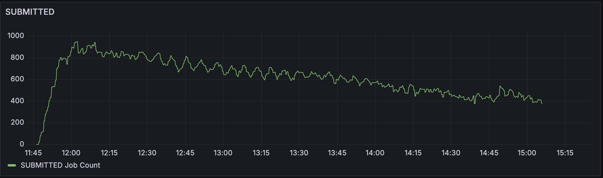

**Calculation**

`locust_submitted_spark_application_gauge`

### Running

This metrics counts the number of sparkapplication in RUNNING state at the given point of time

**Note**: This metrics reflects spark application status at a given point of time. It cannot be added to calculate sum of running spark applications. E.g. A sparkapplication in RUNNING state at T0 probably is also in RUNNING state at T1, so you cannot sum RUNNING sparkapplication count at T0 and T1 to calculate the overall RUNNING sparkapplication count.

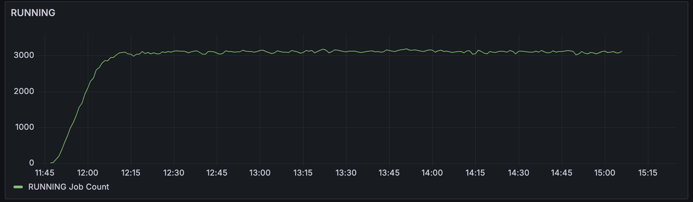

**Calculation**

`locust_running_spark_application_gauge`

### SUCCEEDING

This metric counts the number of sparkapplications in SUCCEEDING state

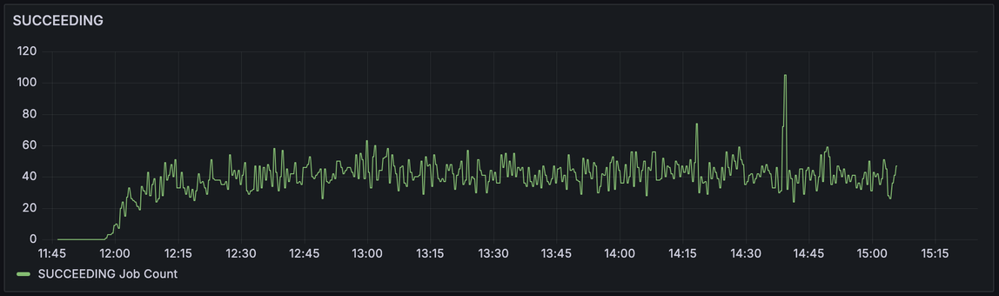

**Calculation**

`locust_succeeding_spark_application_gauge`

### COMPLETED

This metric counts number of sparkapplications in COMPLETED state at the given point of time

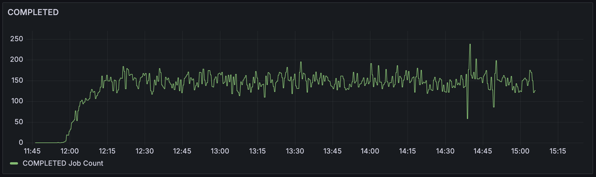

**Calculation**

`locust_completed_spark_application_gauge`


[^ back to top](#spark-job-status-on-eks)

## Node Usage

### 1 min CPU utilization by node

This metrics calculates average CPU utilization per node

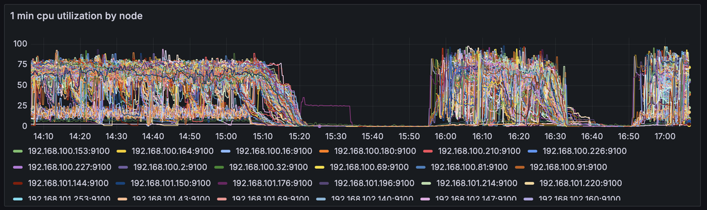

**Calculation**

`100 - (avg by (instance) (rate(node_cpu_seconds_total{mode='idle'}[1m]))*100)`

### Node Count

This metric measures number of running EKS nodes

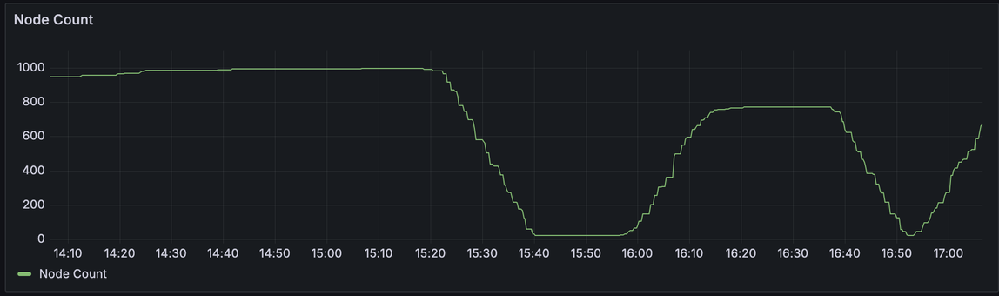

**Calculation**

`max(apiserver_storage_objects{resource="nodes"})`


[^ back to top](#spark-job-status-on-eks)

## Locust Metrics - Client

These metrics are generated from locust client. It counts number of successfully submitted jobs, failed submitted jobs, average job submit time, measured from client side. This tells job submission stats from user perspective.

```
        try:
            submit_job()
            success_counter.inc()
            execution_time_gauge.set(time.time() - start_time)
        except client.exceptions.ApiException as e:
            failed_counter.inc()
```

### Locust Submit (success) rate 1m

This metrics counts number of successful job submits for 1 minute

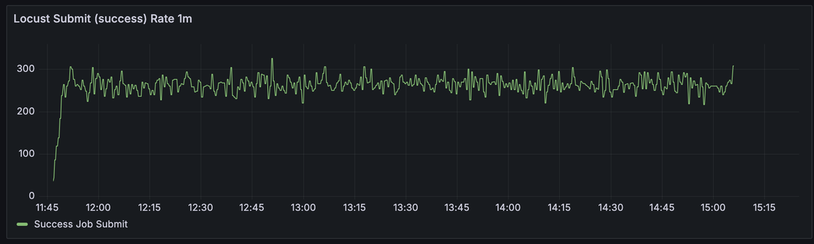

**Calculation**

`increase(locust_spark_application_submit_success_total[1m])`

### Locust Submit Job Total

This metrics counts total successful submitted jobs

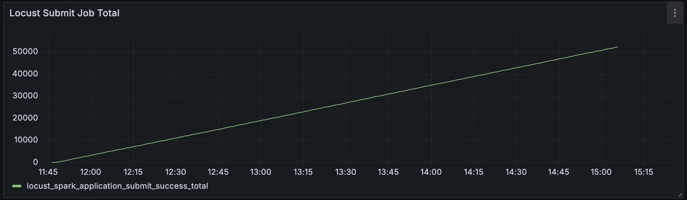

**Calculation**

`locust_spark_application_submit_success_total{instance="ec2-instance"}`

### Locust Submit (fail) Rate

This metric counts number of failed job submits for 1 minute

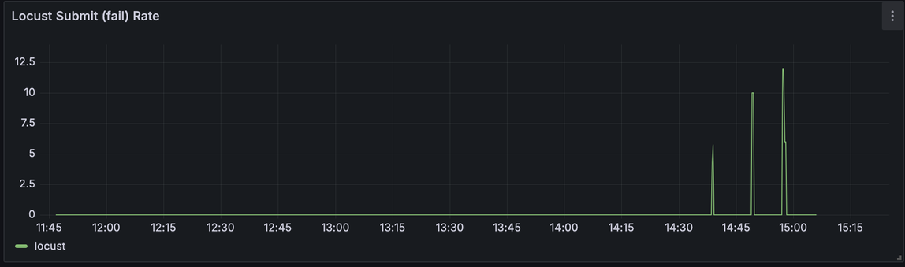

**Calculation**

`locust_spark_application_submit_gauge{instance="ec2-instance"}`

### Locust Submit Job Fail Total

This metric counts number of failed job submits in total

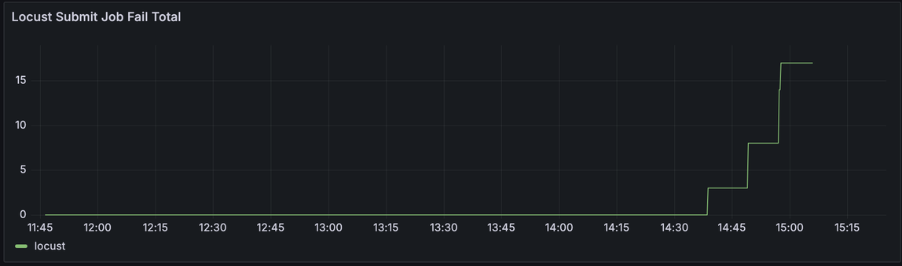

**Calculation**

`locust_spark_application_submit_fail_total{instance="ec2-instance"}`

### Locust Submit Job Time

This metric measures time used to submit a sparkapplication job

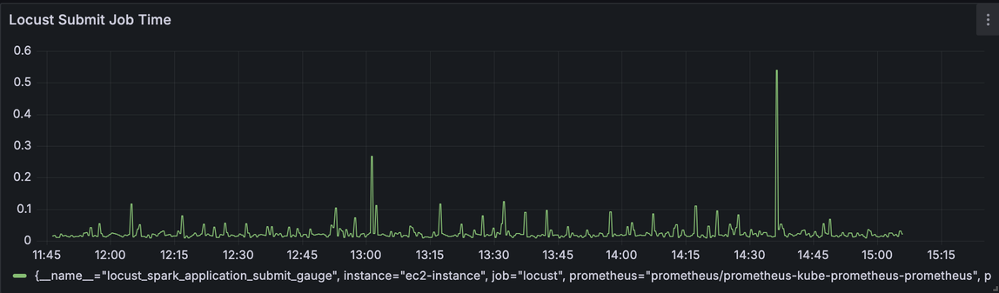

**Calculation**

`locust_spark_application_submit_gauge{instance="ec2-instance"}`

### Locust User Count

This metric counts number of locust users

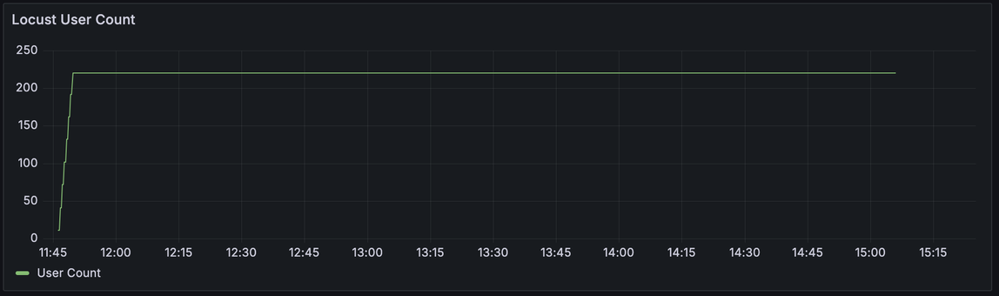

**Calculation**

`locust_concurrent_user`


[^ back to top](#spark-job-status-on-eks)

## Spark Operator Metrics - Server

This group of metrics shows spark operator internal metrics provided from [https://github.com/kubeflow/spark-operator/blob/v1beta2-1.3.8-3.1.1/pkg/controller/sparkapplication/sparkapp_metrics.go](https://github.com/kubeflow/spark-operator/blob/v1beta2-1.3.8-3.1.1/pkg/controller/sparkapplication/sparkapp_metrics.go). Following are the metrics provided by spark operator from the code:

```
type sparkAppMetrics struct {
    labels []string
    prefix string

    sparkAppCount                 *prometheus.CounterVec
    sparkAppSubmitCount           *prometheus.CounterVec
    sparkAppSuccessCount          *prometheus.CounterVec
    sparkAppFailureCount          *prometheus.CounterVec
    sparkAppFailedSubmissionCount *prometheus.CounterVec
    sparkAppRunningCount          *util.PositiveGauge

    sparkAppSuccessExecutionTime  *prometheus.SummaryVec
    sparkAppFailureExecutionTime  *prometheus.SummaryVec
    sparkAppStartLatency          *prometheus.SummaryVec
    sparkAppStartLatencyHistogram *prometheus.HistogramVec

    sparkAppExecutorRunningCount *util.PositiveGauge
    sparkAppExecutorFailureCount *prometheus.CounterVec
    sparkAppExecutorSuccessCount *prometheus.CounterVec
}
```

### Failed Spark Job Per Minutes

This metric measures number of failed spark applications increased per minute

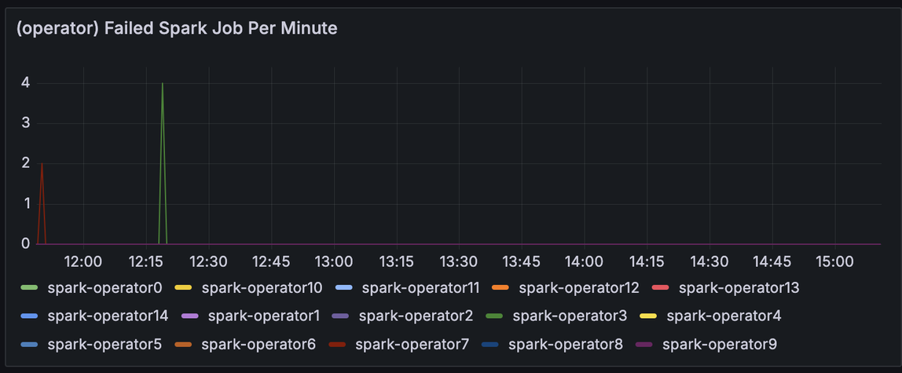

**Calculation**

`increase(spark_app_failure_count [1m])`

### Failed Spark Job Total

This metric measures total number of failed spark jobs detected by spark operator

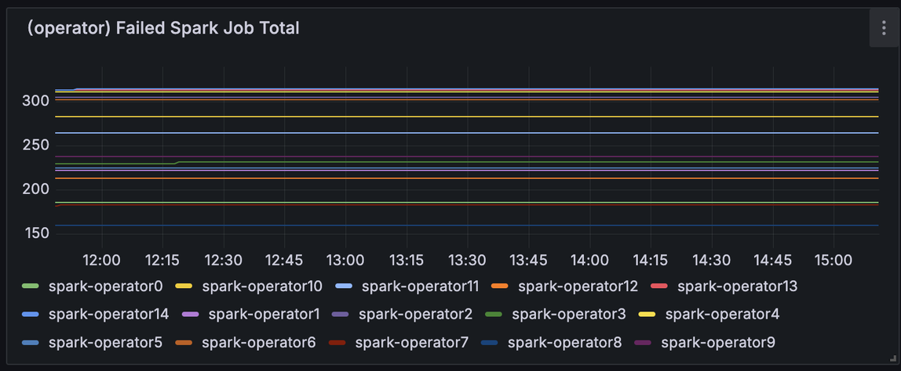

**Calculation**

`spark_app_failure_count`

### Average Job Failure Runtime

This metric measures how long a failed sparkapplication runs

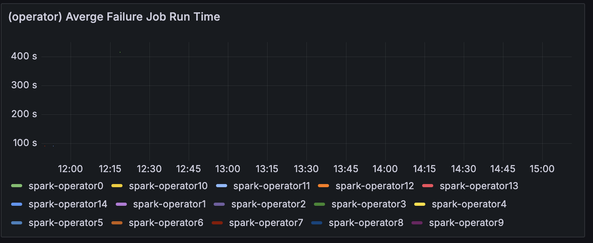

**Calculation**

`rate(spark_app_failure_execution_time_microseconds_sum [1m]) / rate(spark_app_failure_execution_time_microseconds_count [1m])`

### Success Spark Application Per Minute

This metric measures average number of successful spark applications per minute, grouped by namespace, and sum

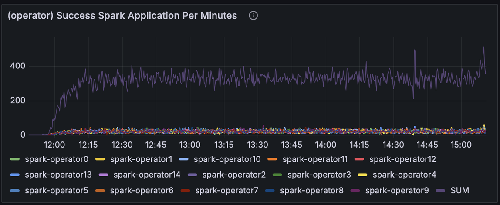

**Calculation**

`rate(spark_app_success_count[1m])*60`

`sum(rate(spark_app_success_count[1m])*60)`

### Success Spark Application Total

This metric measures total number of successful spark applications

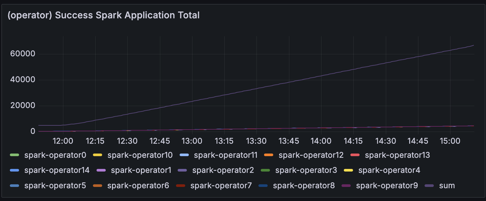

**Calculation**

`spark_app_success_count`

`sum(spark_app_success_count)`

### Average Success Job Run Time

This metric measures average run time of successful spark applications

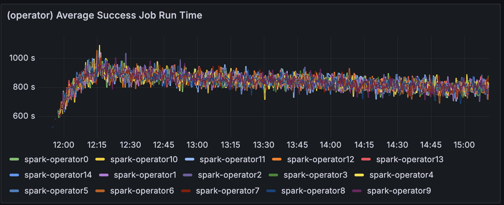

**Calculation**

`rate(spark_app_success_execution_time_microseconds_sum [1m]) / rate(spark_app_success_execution_time_microseconds_count [1m])`

**Note**: `spark_app_success_execution_time_microseconds_sum` calculates duration starting from the job enters Submitted state (spark-submit time) to the time the job enters Succeeding state.

[https://github.com/kubeflow/spark-operator/blob/c261df66a00635509f7d8cb2a7fba4c602c9228e/pkg/controller/sparkapplication/sparkapp_metrics.go#L216](https://github.com/kubeflow/spark-operator/blob/c261df66a00635509f7d8cb2a7fba4c602c9228e/pkg/controller/sparkapplication/sparkapp_metrics.go#L216)


### Spark Application Count Increase Per Minute

This metric measures number of newly created spark applications detected by spark operator, grouped by namespace and sum

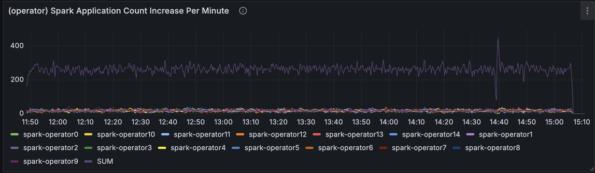

**Calculation**

`rate(spark_app_count[1m])*60`

`sum(rate(spark_app_count[1m])*60)`

### Spark Application Count Total

This metric measures total created spark applications detected by spark operator, grouped by namespace and sum

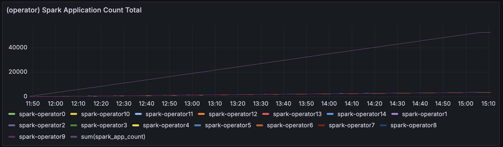

**Calculation**

`spark_app_count`

`sum(spark_app_count)`

### Submitted Spark Application Per Minutes

This metric counts number of submitted spark applications per minute, grouped by namespace and sum. This is a counter and increased when spark application enters Submitted state [https://github.com/kubeflow/spark-operator/blob/c261df66a00635509f7d8cb2a7fba4c602c9228e/pkg/controller/sparkapplication/sparkapp_metrics.go#L204](https://github.com/kubeflow/spark-operator/blob/c261df66a00635509f7d8cb2a7fba4c602c9228e/pkg/controller/sparkapplication/sparkapp_metrics.go#L204)

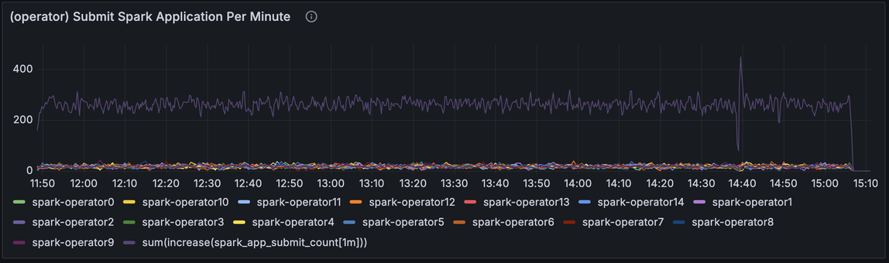

**Calculation**

`increase(spark_app_submit_count[1m])`

`sum(increase(spark_app_submit_count[1m]))`

### Submitted Spark Application Total

This metric counts total number of submitted spark applications, grouped by namespace and sum

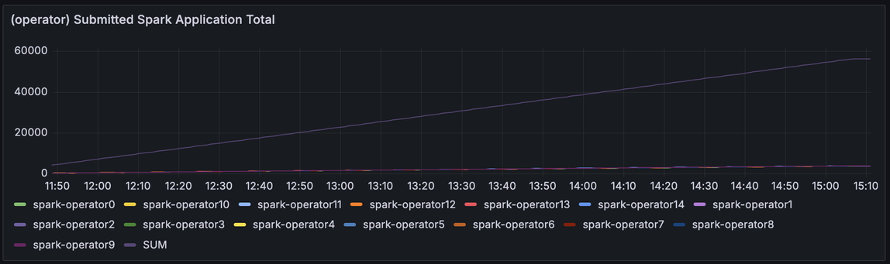

**Calculation**

`spark_app_submit_count`

`sum(spark_app_submit_count)`

### Running Spark Application Count

Metrics is based on `spark_app_running_count`. `spark_app_running_count` is a counter, this counter is increased by 1 when a spark job enters Running state [https://github.com/kubeflow/spark-operator/blob/c261df66a00635509f7d8cb2a7fba4c602c9228e/pkg/controller/sparkapplication/sparkapp_metrics.go#L210](https://github.com/kubeflow/spark-operator/blob/c261df66a00635509f7d8cb2a7fba4c602c9228e/pkg/controller/sparkapplication/sparkapp_metrics.go#L210), and decreases when a spark application enters Succeeding state [https://github.com/kubeflow/spark-operator/blob/c261df66a00635509f7d8cb2a7fba4c602c9228e/pkg/controller/sparkapplication/sparkapp_metrics.go#L222](https://github.com/kubeflow/spark-operator/blob/c261df66a00635509f7d8cb2a7fba4c602c9228e/pkg/controller/sparkapplication/sparkapp_metrics.go#L222). So it means (TotalNumberOfSparkApplicationEnteredRunningState - TotalNumberOfSparkApplicationEnteredSucceedingState)

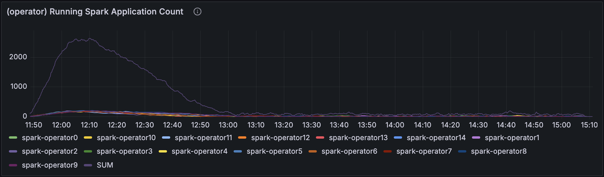

**Calculation**

`spark_app_running_count`

`sum(spark_app_running_count)`

### Spark Application Start Latency

This metric measures the duration from the application is created (New State) to the time when the application entered Running state. In other words, it includes two time costs in two phases:
- Phase 1: from the time user creates spark application to the time spark operator runs spark-submit
- Phase 2: from spark operator runs spark-submit to the time when application starts running

[https://github.com/kubeflow/spark-operator/blob/c261df66a00635509f7d8cb2a7fba4c602c9228e/pkg/controller/sparkapplication/sparkapp_metrics.go#L300](https://github.com/kubeflow/spark-operator/blob/c261df66a00635509f7d8cb2a7fba4c602c9228e/pkg/controller/sparkapplication/sparkapp_metrics.go#L300)

[https://github.com/kubeflow/spark-operator/blob/c261df66a00635509f7d8cb2a7fba4c602c9228e/pkg/controller/sparkapplication/sparkapp_metrics.go#L212](https://github.com/kubeflow/spark-operator/blob/c261df66a00635509f7d8cb2a7fba4c602c9228e/pkg/controller/sparkapplication/sparkapp_metrics.go#L212)

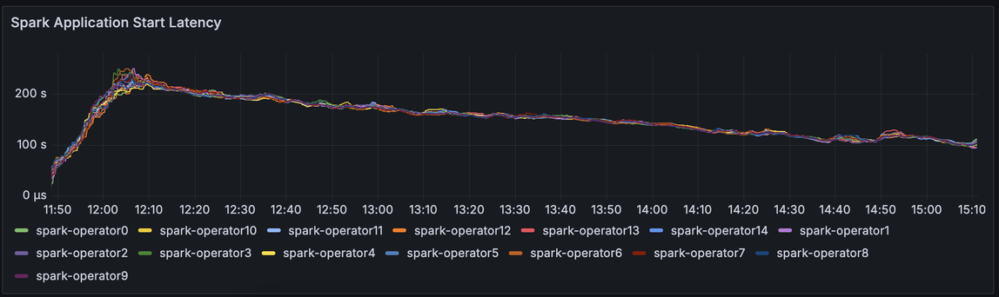

**Calculation**

`rate(spark_app_start_latency_microseconds_sum[5m])/rate(spark_app_start_latency_microseconds_count[5m])`


[^ back to top](#spark-job-status-on-eks)

## How to use these metrics

These metrics provide different dimensions to observe the cluster. Following are some scenarios about how to read these metrics.

### Spark Operator Controller Throttling

In the center of spark application is a kubernetes workqueue. The input and output of the workqueue can be rate-limited. When this happens, the workqueue performance will start to degrade. Following are some symptoms when this issue happens:

1. You will see spark_application_controller_adds and spark_application_controller_work_duration_count increase in the beginning then drop to low value. Our observation is once these 2 metrics value drops to 1-2 that means throttling is happening. For example,

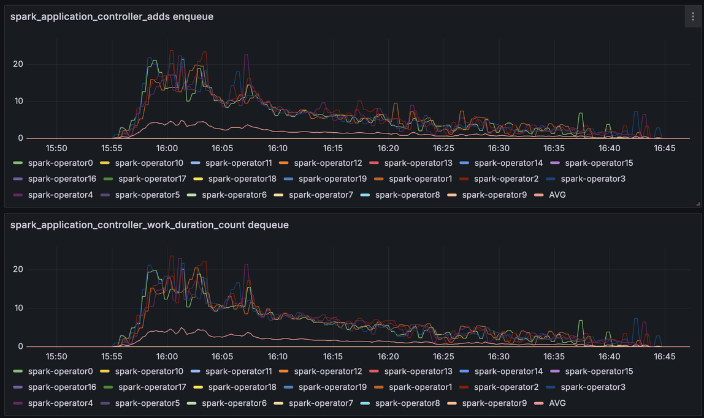

When workqueue is in healthy state, these two metrics should maintain at a stable level, e.g.

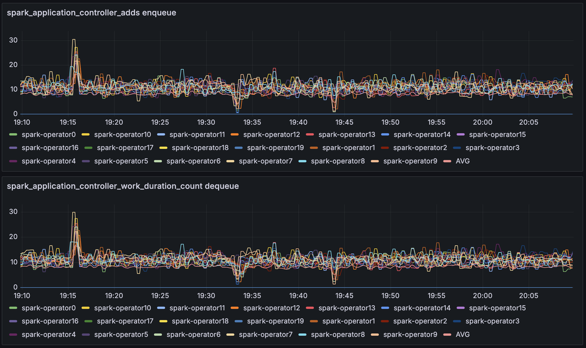

2. Another symptom when workqueue is rate-limited is happening, is number of spark applications in NEW, SUBMITTED, SUCCEEDING, COMPLETED state are all increasing. This is because the workqueue slows down so it cannot update sparkapplication status in time.

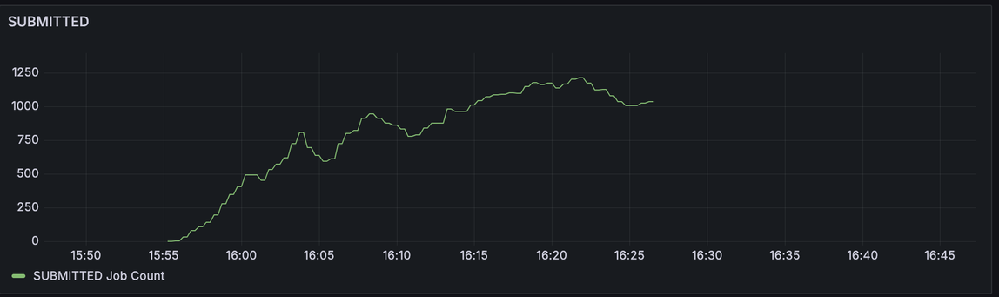
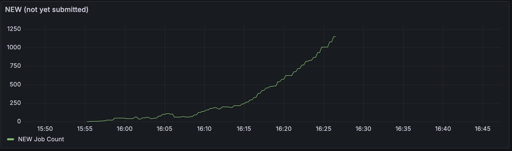
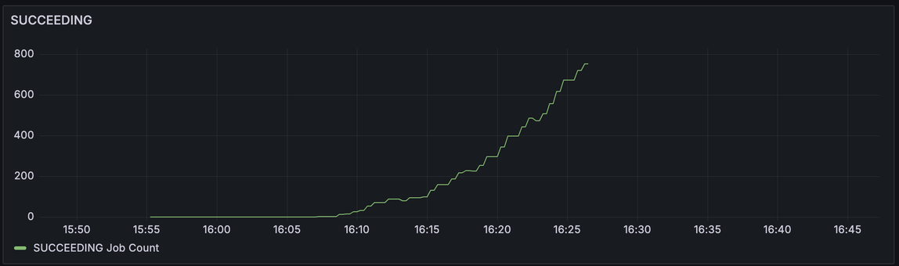
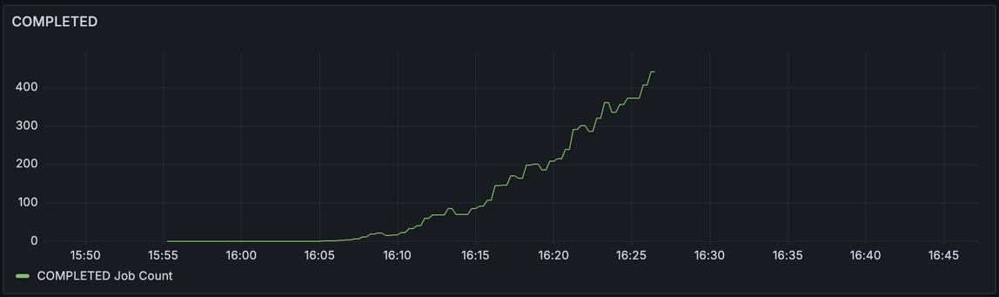

When workqueue is healthy, number of jobs in NEW, SUCCEEDING, COMPLETED should be at stable level, e.g.

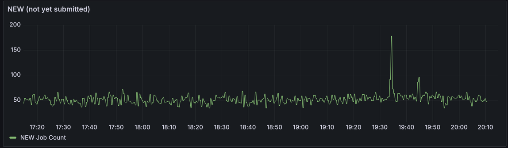
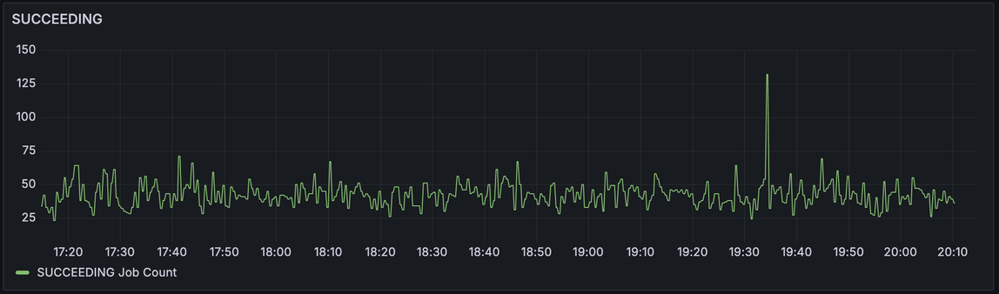
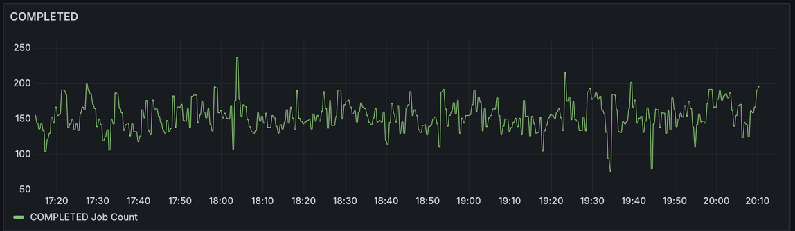

### Insufficient capacity

When the cluster has insufficient capacity, jobs will stay in Submitted status for a long time. When this happens, you will see SUBMITTED status job number increase. e.g.

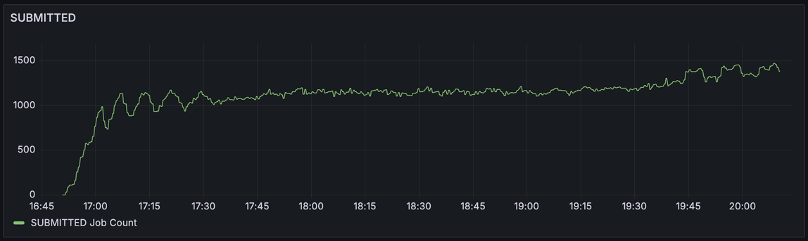

The increase in SUBMITTED applications is due to low capacity and auto-scaler is trying to add nodes

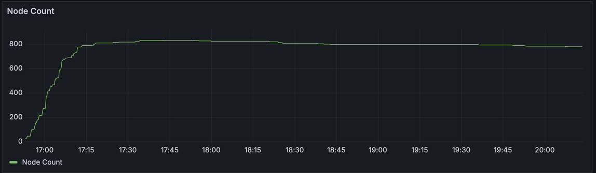

### Concurrent running jobs

Depending on how you define concurrent running jobs. If the concurrent running job is the number of spark applications in Running state at a given point of time, then you can use number of running driver pods

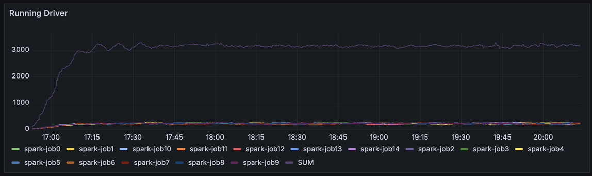
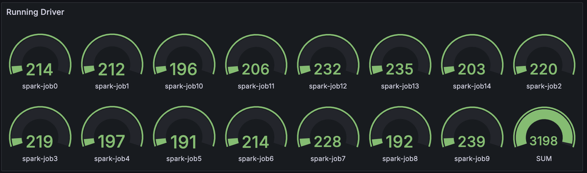

If the workqueue is healthy and has no throttling, you can also use `kubectl get sparkapplication | grep Running` to see the number of running spark applications

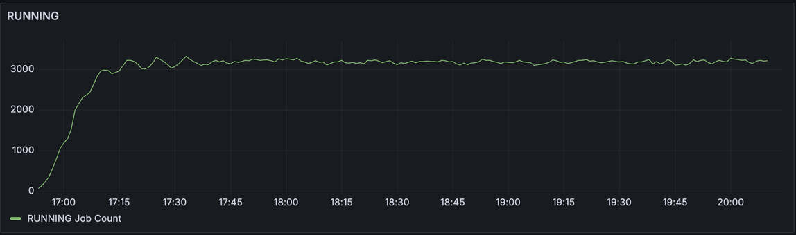

### Job Start Latency

Sparkapplication has multiple phases, e.g.

At time T0, user creates sparkapplication. At time T1, spark operator detects new sparkapplication and runs spark-submit to submit the job. After the job is submitted, it will stay in pending state until T2 when capacity is sufficient and driver becomes Running state and spark operator also sets spark application to Running state.

Metric Spark Application Start Latency measures the time T2 - T0.


Spark operator does not have a metric to measure T1 - T0. This duration is used by spark operator workqueue to detect the newly created spark application. However, we can use metric Spark Application Controller Latency and Spark Application Controller Task Process Time to estimate time T1 - T0, as these two metrics measure how much time an item has to stay in the queue until it is fetched and the time used by each worker to process the item.


[^ back to top](#spark-job-status-on-eks)